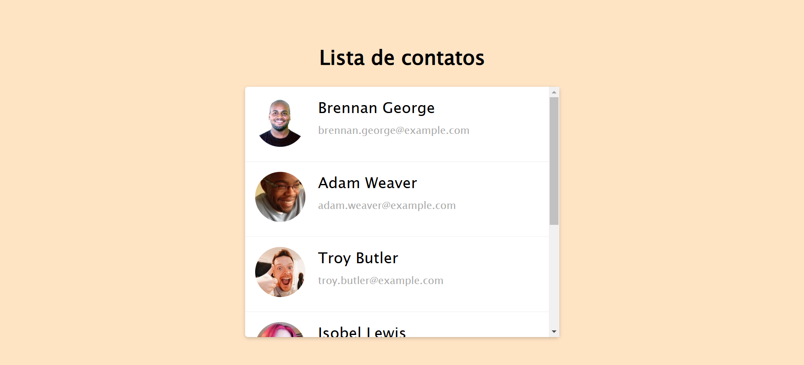
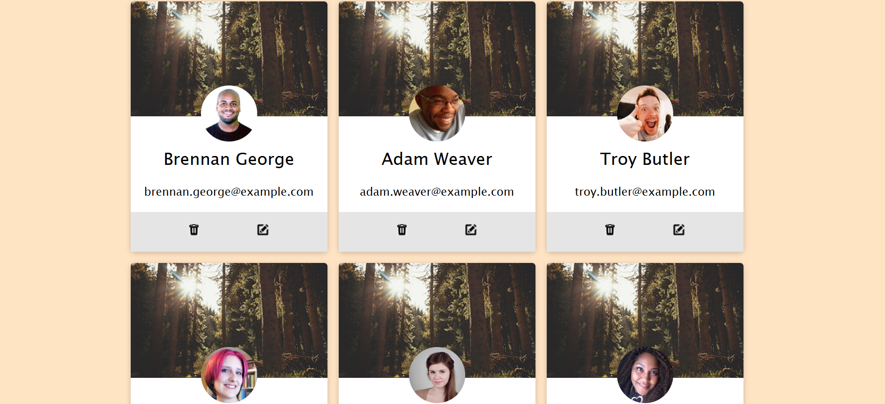

# Contact List

Este projeto é uma aplicação de lista de contatos, onde os usuários podem visualizar, adicionar, editar e excluir contatos de uma lista. O objetivo deste projeto é praticar habilidades de desenvolvimento front-end e criar uma interface interativa e fácil de usar.

## Tecnologias Usadas

- HTML
- CSS

## Deploy

O site está disponível em: [https://PhabloY.github.io/contact-list/](https://PhabloY.github.io/contact-list/)

## Layouts

### Layout 1

Este é o layout inicial da aplicação. Ele contém as funcionalidades principais para visualizar e gerenciar os contatos.

### Layout 2

Aqui está o segundo layout, que apresenta algumas melhorias na interface e uma nova organização visual dos contatos.